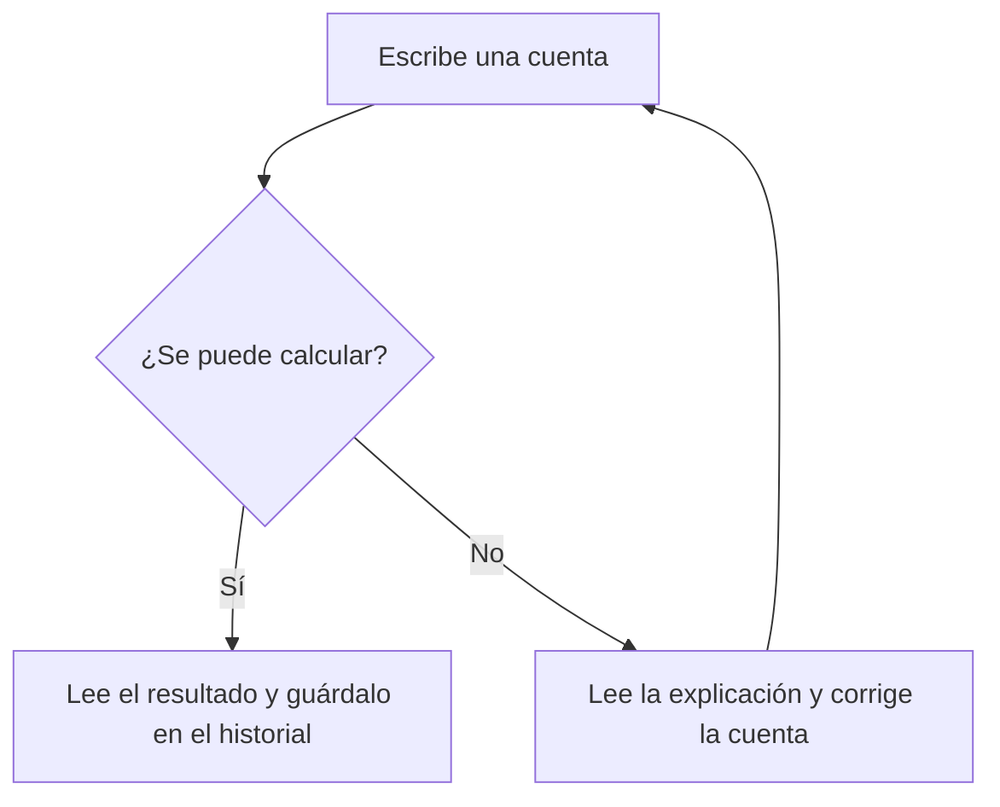

# CalcX

Haz una cuenta rápida o quédate un rato resolviendo varias. CalcX calcula porcentajes, raíces, potencias y funciones científicas desde una ventana de terminal. Guarda las cuentas para que puedas volver a consultarlas.

[Ver comprobaciones](https://github.com/genesisgzdev/calcx-advanced/actions) · [Manual](docs/MANUAL.md) · [Cómo funciona](docs/ARCHITECTURE.md)

## Empieza aquí

Necesitas Python 3.10 o posterior. Descarga este repositorio y abre una terminal dentro de su carpeta. En Windows usa `python`; en Linux o macOS puede llamarse `python3`.

```sh
python -m calcx
```

Verás ejemplos y una invitación a escribir tu cuenta. Prueba `80 * 15 / 100` y pulsa Enter. El resultado es 12, el 15 % de 80. Para cerrar, escribe `salir`.

¿Solo quieres resolver una cuenta?

```sh
python -m calcx "sqrt(144)"
```

## Lo que puedes escribir

| Quieres calcular | Escribe |
| --- | --- |
| Repartir 120 entre cuatro | `120 / 4` |
| El 15 % de 80 | `80 * 15 / 100` |
| Aplicar un descuento del 20 % | `80 * (1 - 20 / 100)` |
| Una raíz cuadrada | `sqrt(144)` |
| Una potencia | `2^10` |
| Un ángulo en radianes | `sin(pi / 2)` |
| Un número complejo | `sqrt(-9)` |

Usa un punto para los decimales. La multiplicación se escribe `*`. El símbolo `%` calcula el resto de una división; para porcentajes usa la fórmula de la tabla.

## Una calculadora que te acompaña

Dentro de CalcX puedes escribir `ayuda`, `funciones` o `historial`. `precision 40` cambia las próximas cuentas a 40 cifras significativas. `borrar` elimina el historial guardado y `salir` cierra la calculadora. Los comandos anteriores en inglés siguen funcionando.



## Instalar el comando corto

Desde la carpeta del proyecto puedes instalarlo en un entorno de Python:

```sh
python -m venv .venv
```

Actívalo con `.venv\Scripts\activate` en Windows o `source .venv/bin/activate` en Linux y macOS. Después ejecuta:

```sh
python -m pip install .
calcx
```

Si usas Bash, `./calcx.sh` abre la misma calculadora. No necesitas instalar bibliotecas externas para hacer cuentas.

## Cuando necesitas más detalle

La precisión decimal puede ajustarse de 1 a 1000 cifras. Las funciones trigonométricas y complejas tienen la precisión del cálculo de máquina; pedir más cifras no añade precisión a esas funciones. `sqrt` conserva la precisión decimal para valores decimales no negativos.

Las operaciones de matrices, integración y transformadas están disponibles como funciones Python, explicadas en el [manual](docs/MANUAL.md). No se anuncian como comandos de la calculadora si aún no lo son.

Para conectar CalcX con otro programa usa `calcx --json "2+2"`. Recibirás un objeto con el resultado. Consulta el [contrato de salida y los límites de cálculo](docs/ARCHITECTURE.md).

## Si algo no sale

- Si no reconoce `calcx`, usa `python -m calcx` desde la carpeta del proyecto
- Si una cuenta falla, revisa paréntesis, nombres de funciones y divisiones entre cero
- Si no puede guardar el historial, muestra el resultado y avisa del problema de escritura

Para comprobar el proyecto ejecuta `python -m unittest discover -s tests -p "test_*.py"`. El [mapa de archivos](docs/REPOSITORY_MAP.md) te ayuda a encontrar cada parte.

Licencia [MIT](LICENSE).
