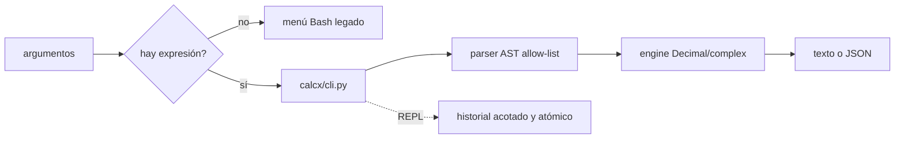

# CalcX Advanced

Calculadora científica de terminal para personas y scripts. La ruta de expresiones usa un AST de Python con allow-list explícita, no `eval`, y devuelve texto o JSON determinista.

En 30 segundos: ejecuta `./calcx.sh 'sqrt(144)'` para una cuenta, `--json` para automatización y `--interactive` para la REPL Python. Sin expresión, el wrapper conserva el menú Bash histórico. El núcleo no necesita dependencias externas obligatorias.

[](https://github.com/genesisgzdev/calcx-advanced/actions/workflows/ci.yml)
[](https://github.com/genesisgzdev/calcx-advanced/releases)
[](LICENSE)

## Qué está respaldado hoy

- Decimal arithmetic with configurable precision
- Complex numbers, matrices and numerical methods
- Trigonometric, logarithmic, hyperbolic and rounding functions
- JSON output for scripts and other tools
- A menu interface, a direct CLI and an interactive Python REPL
- configuración XDG e historial acotado con escritura atómica

La evidencia es el código de [`calcx/`](calcx/), los tests de [`tests/`](tests/) y los checks de shell listados más abajo. La arquitectura completa, con las dos rutas de entrada y sus límites, está en [`docs/ARCHITECTURE.md`](docs/ARCHITECTURE.md).

## Flujo principal



Los módulos matemáticos, la precedencia de configuración y la secuencia de errores están en el documento de arquitectura.

El paquete principal no necesita dependencias externas. Puedes añadir `mpmath` para funciones de precisión arbitraria.

## Inicio rápido

```bash
git clone https://github.com/genesisgzdev/calcx-advanced.git
cd calcx-advanced

./calcx.sh 'sqrt(144)'
./calcx.sh --json '2 + 2'
./calcx.sh --precision 50 '1/7'
./calcx.sh --interactive
```

To install the `calcx` command with `pipx`:

```bash
python3 -m pip install --user pipx
pipx install .
calcx '2^10'
```

`^` is accepted as exponentiation. Constants include `pi`, `e`, `tau` and `i`.

## Límites de confianza

Las expresiones se analizan con el AST de Python y se comparan con una lista explícita de nodos permitidos. CalcX no llama a `eval`, `exec`, un shell ni comandos proporcionados por el usuario. Las expresiones inválidas se informan por `stderr` y devuelven un código distinto de cero.

Esto respalda el rechazo de ejecución de código dentro del evaluador y una interfaz útil para automatización. No respalda precisión certificada, seguridad financiera ni resultados safety-critical: esos resultados deben verificarse por una segunda vía.

## Configuración e historial

El archivo de configuración opcional se lee desde `$XDG_CONFIG_HOME/calcx/config.env` o `~/.config/calcx/config.env`:

```text
PRECISION=40
HISTORY_LIMIT=500
HISTORY_FILE=~/.local/state/calcx/history
```

`CALCX_PRECISION`, `CALCX_HISTORY_LIMIT` and `CALCX_HISTORY` override the file. Command-line options take precedence over both. History is stored under `~/.local/state/calcx` by default.

## Instalar y comprobar

```bash
python3 -m unittest discover -s tests -p 'test_*.py' -v
bash tests/run_tests.sh
python3 -m compileall -q calcx
bash -n calcx.sh
```

Versión actual: `2.0.4`. La implementación Bash de `src/` queda por compatibilidad y auditoría; el cálculo moderno pasa por el paquete Python.

Para una lectura más profunda: [manual de uso](docs/MANUAL.md), [arquitectura](docs/ARCHITECTURE.md) y [cambios por versión](CHANGELOG.md).

## Licencia

MIT. See [LICENSE](LICENSE).
