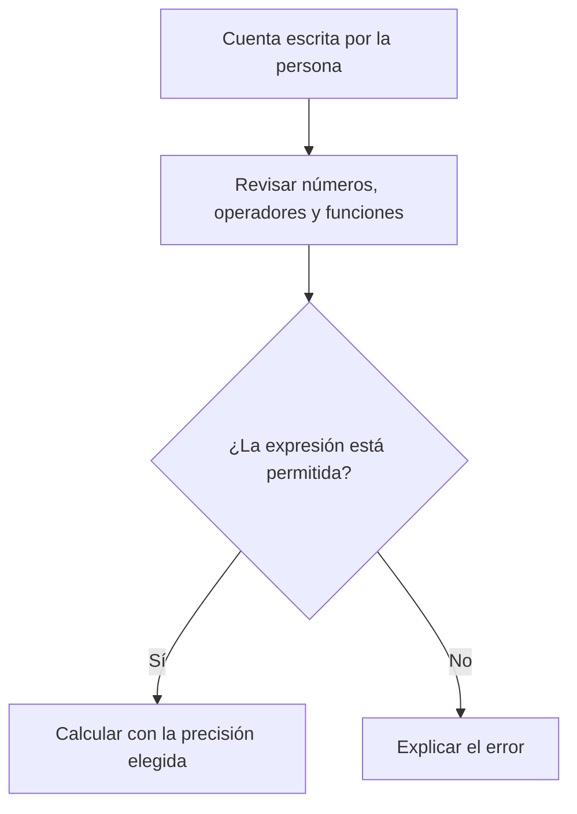

# Cómo funciona CalcX

Una cuenta recorre tres pasos: entender lo que escribiste, calcularlo y presentar el resultado. Puedes usar CalcX sin conocer estas piezas. Esta guía sirve para revisar o ampliar el programa.

## Del texto al resultado

El resultado se muestra antes de guardar el historial. Si falla el guardado, se conserva la cuenta calculada y se avisa del problema. Eso evita que una carpeta sin permisos convierta un resultado válido en un error de cálculo.

| Archivo | Trabajo que realiza |
| --- | --- |
| `calcx/cli.py` | Conversación de la calculadora, ayuda y salida para otros programas |
| `calcx/config.py` | Leer y comprobar las preferencias |
| `calcx/engine.py` | Entender expresiones y calcularlas |
| `calcx/history.py` | Guardar y consultar cuentas |
| `calcx/operations.py` | Funciones avanzadas para programas Python |

`calcx.sh`, `src/calcx-advanced.sh`, `python -m calcx` y el comando instalado llegan al mismo paquete Python. El menú Bash antiguo no recibe expresiones en el recorrido mantenido.

## Qué significa «entender una cuenta»

El motor usa el analizador de expresiones de Python, llamado AST, pero solo acepta números, nombres conocidos, operadores y llamadas de su lista. No ejecuta código Python escrito en la cuenta. Atributos, importaciones y estructuras ajenas a ese lenguaje de calculadora se rechazan.

Las entradas decimales se leen de su texto original para evitar redondearlas primero a un número binario. Las operaciones con `Decimal` y la raíz de un decimal no negativo respetan la precisión elegida. Las funciones de `math` y `cmath`, incluidas las trigonométricas y las complejas, conservan precisión de máquina. Las constantes `pi`, `e` y `tau` tampoco ganan cifras al aumentar la configuración.

## Tamaños y precisión

| Control | Valor actual | Por qué existe |
| --- | --- | --- |
| Precisión decimal | 1 a 1000 cifras | Mantener un tamaño de cálculo explícito |
| Longitud de una expresión | 4096 caracteres | Rechazar entradas desproporcionadas |
| Partes del árbol de expresión | 256 | Controlar la complejidad del análisis |
| Magnitud del exponente | 10 000 | Evitar crecimientos numéricos desproporcionados |
| Argumento de factorial | 0 a 1000, entero | Mantener calculable y representable el resultado |
| Matriz | Hasta 128 por 128 | Acotar el trabajo de inversión |
| Integración de Simpson | Hasta 1 000 000 de intervalos pares | Acotar evaluaciones de la función |
| Transformada DFT | Hasta 4096 muestras | Esta implementación requiere trabajo cuadrático |

La inversa de matrices comprueba valores finitos y compara los pivotes con la escala de la matriz. Newton comprueba el residuo, reconoce una raíz exacta antes de dividir y limita sus iteraciones. La ecuación cuadrática evita una resta que perdería precisión cuando sus términos son muy parecidos.

## Preferencias e historial

Se aplica primero `--precision`, después el entorno y después `config.env`. Sin configuración se usan 28 cifras y se conservan 1000 cuentas. Los valores fuera del rango permitido se rechazan; no se sustituyen silenciosamente por otro valor.

`precision 40` cambia la sesión abierta. El historial usa un bloqueo entre procesos y reemplaza el archivo mediante una escritura temporal privada. Cada escritor vuelve a leer las últimas cuentas antes de añadir la suya. No es una base multiusuario.

## Comprobar un cambio

`tests/test_engine.py` y `tests/test_regressions.py` comprueban resultados, composición decimal, rechazo de código, errores y escritura concurrente. Los tests de interfaz cubren la conversación y que JSON no abra una sesión por accidente. `tests/run_tests.sh` comprueba también las entradas Bash.

El modo directo devuelve 0 al calcular y 2 ante errores esperados. Con `--json`, el resultado o error de cálculo es un objeto. Los errores de argumentos y configuración usan la salida de errores.

[Volver al manual](MANUAL.md) · [Mapa completo de archivos](REPOSITORY_MAP.md)
